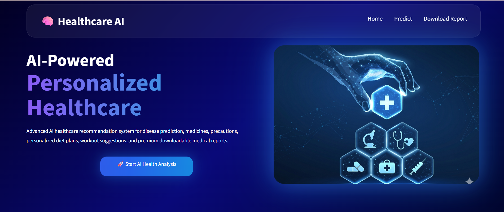
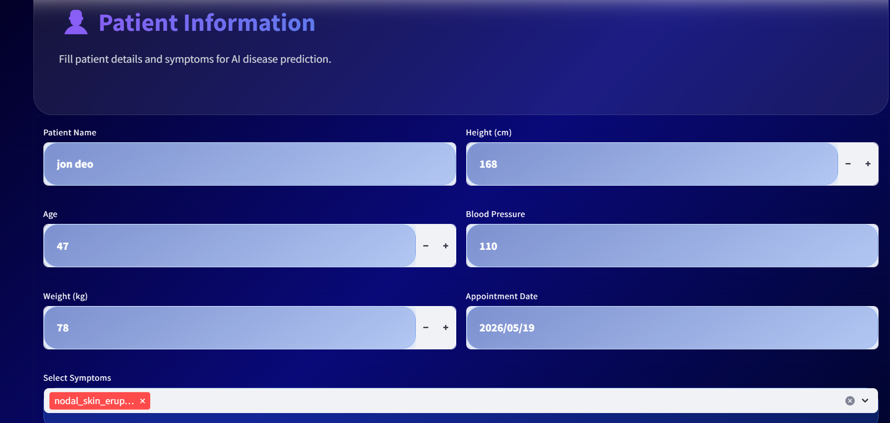
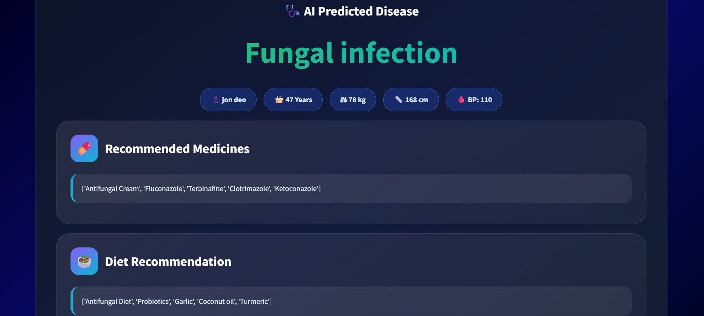
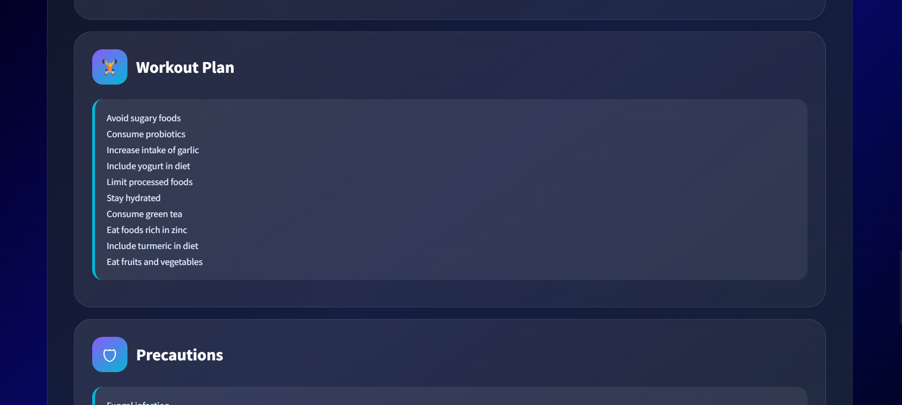
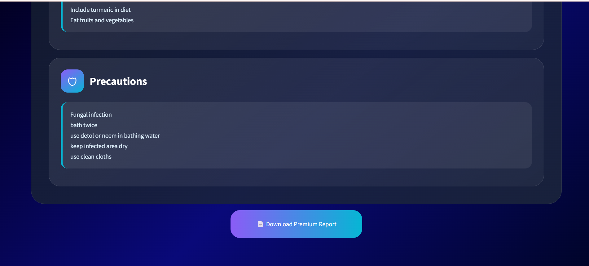

# 🩺 AI Personalized Healthcare


An AI-powered Streamlit application that predicts possible diseases from user-selected symptoms and delivers personalized healthcare guidance, including medicines, precautions, diet plans, workout suggestions, and a downloadable PDF report.

---

## 📌 Features

- 🧠 Disease prediction from symptoms using a trained machine learning model
- 💊 Personalized medicine recommendations
- 🛡 Safety precautions and health advice
- 🥗 Diet recommendations and workout suggestions
- 📄 Downloadable PDF health report
- 🎨 Clean Streamlit user interface with patient information input

---

## 🛠️ Tech Stack

- Python
- Streamlit
- Pandas
- NumPy
- Scikit-learn
- Joblib
- ReportLab

---

## 📁 Project Structure

```
Healthcare-AI/
├── app.py
├── brain.png
├── diets.csv
├── medications.csv
├── precautions_df.csv
├── workout_df.csv
├── Training.csv
├── healthcare_model.pkl
├── label_encoder.pkl
├── requirements.txt
└── README.md
```

---

## ⚙️ Installation

### 1. Clone the repository

```bash
git clone https://github.com/your-username/Healthcare-AI.git
cd Healthcare-AI
```

### 2. Create a virtual environment

```bash
python -m venv venv
```

Activate it:

- Windows:
  ```bash
  venv\Scripts\activate
  ```
- macOS / Linux:
  ```bash
  source venv/bin/activate
  ```

### 3. Install dependencies

```bash
pip install -r requirements.txt
```

### 4. Run the application

```bash
streamlit run app.py
```

Open the URL shown in the terminal to use the app.

---

## 🧠 How it works

1. Enter patient details and select symptoms
2. Submit the form
3. The model predicts a likely disease
4. The app displays medicine, diet, workout, and precaution recommendations
5. Download a PDF health report for the patient

---

## 📊 Example output

- Predicted disease: `Diabetes`
- Medicines: `Metformin`, `Insulin` (if required)
- Precautions: `Avoid sugar`, `Monitor glucose levels`
- Diet: `High fiber`, `Low carbs`
- Workout: `30 minutes walking daily`

---

## � Project Screenshots

### 🏠 Home Page

<p align="center">
  
</p>

### 🧠 Prediction Page

<p align="center">
  
</p>

### 📄 Report Page

<p align="center">
  
</p>

<p align="center">
  
</p>

<p align="center">
  
</p>

---

## �📌 Notes

- Make sure `healthcare_model.pkl` and `label_encoder.pkl` are present in the project root.
- Update the `.csv` files if you want to change the recommendation data.

-------


